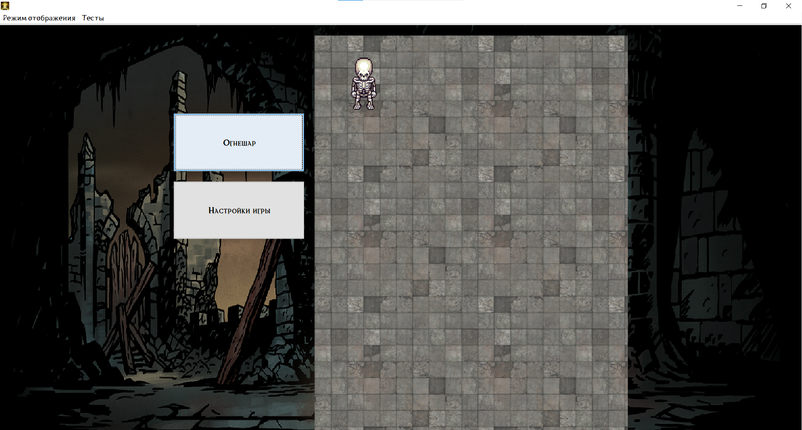
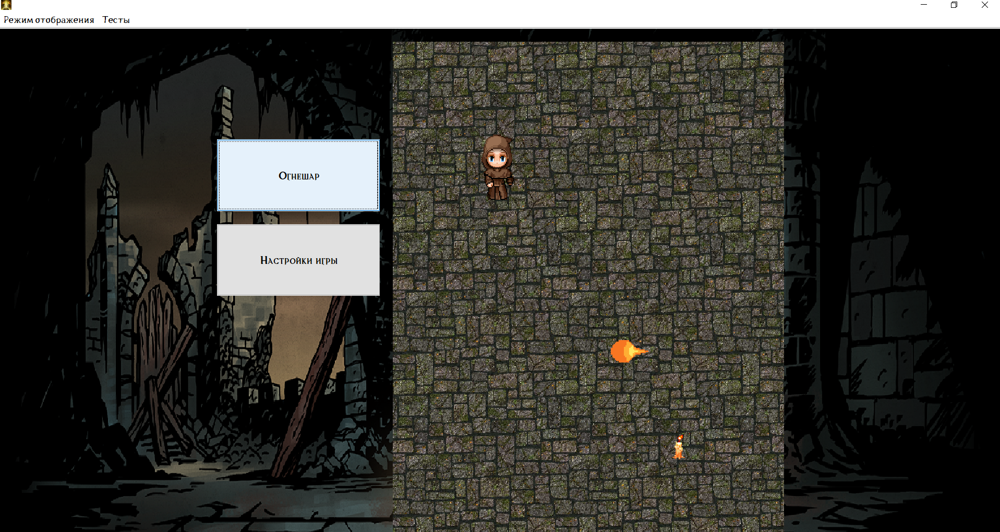
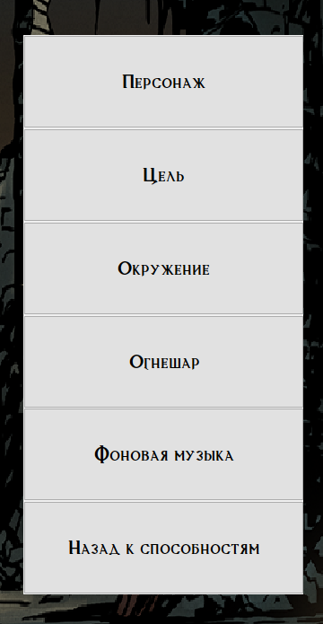
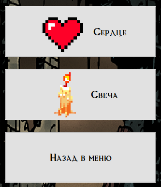

# Герои в подземельях
***
Данный проект реализовывался как учебный проект по курсу ООП для изучения ОО дизайна
и асинхронных событий.

В данной игре персонаж следует за целью, которая выставляется кликом мыши. В настройках
можно изменить образ персонажа и многих игровых объектов. Так же есть возможность выбора фоновой музыки.
Все ошибки логируются, сам же лог можно открыть через панель управления программы. В игре присутствует 
магическое событие в виде огнешара, который отталкивает персонажа по ходу своего движения. Если же огнешар
задевает цель, то он её уничтожает.

Отличительной особенностью можно считать удобное добавление новых образов персонажей и окружения,
 что открывает почти неограниченный простор для кастомизации. 
[Как добавить свой скин.](src/main/resources/properties/properties.md)

P.s. Открыть окно логирования можно по пути `Тесты -> Открыть протокол работы`

## Скриншоты из игры

## Выполняли
* [Глазунов Никита](https://github.com/GlazProject)
* [Земляная Евгения](https://github.com/zzemlyanaya)